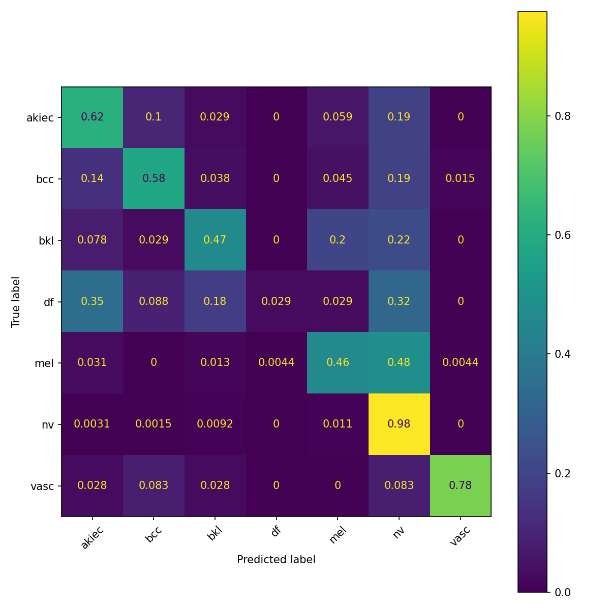
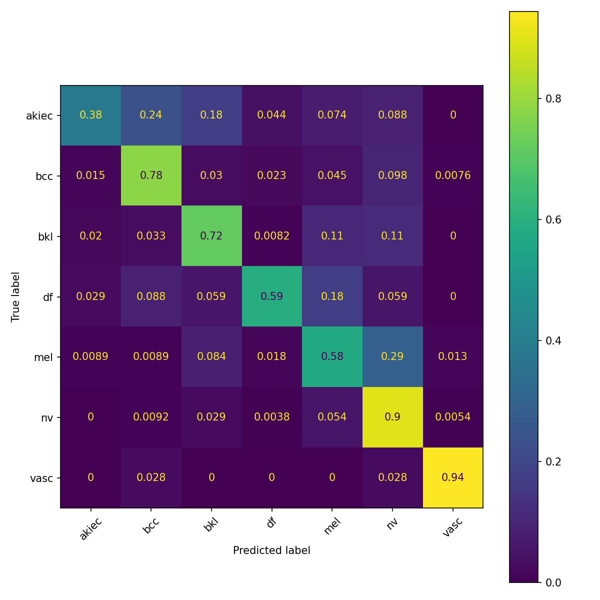
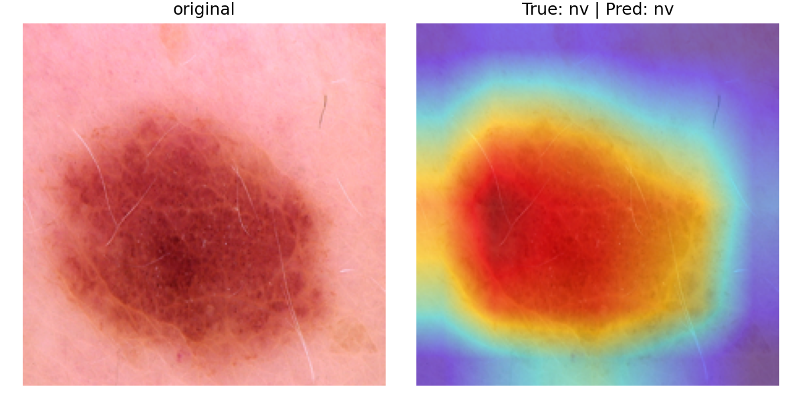
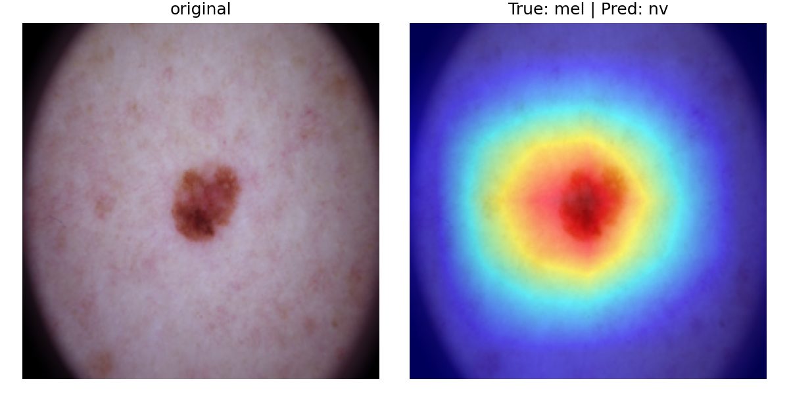

# HAM10000 Skin Lesion Classifier

A ResNet18-based classifier for seven types of pigmented skin lesions, with class-imbalance handling, image augmentation, experiment tracking, and Grad-CAM interpretability.

## Motivation

Skin cancer is among the most common cancers worldwide, and melanoma — though a small fraction of cases — causes the majority of skin-cancer deaths. It is highly treatable when caught early, which makes reliable visual screening valuable, especially where access to dermatologists is limited. [HAM10000](https://doi.org/10.7910/DVN/DBW86T) ("Human Against Machine with 10,000 training images") is a benchmark dataset of 10,015 dermatoscopic images spanning seven diagnostic categories. This project trains and interrogates a classifier on it — not as a clinical tool, but as an end-to-end demonstration of a sound, reproducible ML pipeline on a realistically messy medical dataset.

## Dataset

HAM10000 contains 10,015 dermatoscopic images across seven lesion types:

| Code | Lesion type | Images | Share |
|------|-------------|-------:|------:|
| nv | Melanocytic nevi (benign moles) | 6,705 | 66.9% |
| mel | Melanoma | 1,113 | 11.1% |
| bkl | Benign keratosis-like lesions | 1,099 | 11.0% |
| bcc | Basal cell carcinoma | 514 | 5.1% |
| akiec | Actinic keratoses / intraepithelial carcinoma | 327 | 3.3% |
| vasc | Vascular lesions | 142 | 1.4% |
| df | Dermatofibroma | 115 | 1.1% |

The defining challenge is **severe class imbalance**: the largest class (`nv`) is roughly 58× the size of the smallest (`df`). A model that simply predicts `nv` for everything would score ~67% accuracy while being clinically useless — so accuracy alone is a misleading metric here, and per-class performance is what matters.

A second subtlety: the 10,015 images correspond to fewer unique lesions, since some lesions are photographed multiple times. Splitting naively by image would leak the same lesion into both train and validation, inflating results. This project splits by `lesion_id` instead.

## Methods

**Model.** A ResNet18 pretrained on ImageNet, with its final fully-connected layer replaced by a new linear layer of seven outputs (transfer learning). The full network is fine-tuned.

**Data split.** Train/validation are split at the **lesion level** (on `lesion_id`, not `image_id`) and seeded for reproducibility, so no lesion appears in both sets. A unit test asserts zero lesion overlap between the splits.

**Training.** Adam optimizer, cross-entropy loss, configurable via a YAML file (`configs/baseline.yaml`) — no hyperparameters are hard-coded. The lowest-validation-loss checkpoint is saved during training.

**Augmentation.** Applied to the training set only (validation stays deterministic to keep metrics stable): random resized crop, horizontal flip, rotation, and mild color jitter. Color jitter is kept small because color is diagnostically meaningful for skin lesions.

**Class-imbalance handling.** Inverse-frequency ("balanced") class weights, computed from the training split only, are passed to the loss function so that errors on rare classes are penalized more heavily. This is toggled by a config flag for clean before/after comparison.

## Results

Class weighting produced large gains on minority classes while keeping overall accuracy flat:

| Class | Baseline F1 | Weighted F1 |
|-------|------------:|------------:|
| akiec | 0.49 | 0.51 |
| bcc | 0.66 | 0.70 |
| bkl | 0.59 | 0.73 |
| df | 0.06 | **0.51** |
| mel | 0.51 | 0.55 |
| nv | 0.91 | 0.90 |
| vasc | 0.84 | 0.83 |
| **Macro-F1** | **0.58** | **0.69** |
| **Accuracy** | **0.80** | **0.81** |

The headline finding: weighting raised **macro-F1 from 0.58 to 0.69** and lifted the rarest class (`df`) from a **recall of 0.03 to 0.50** and melanoma recall from **0.46 to 0.61** — all while overall accuracy held steady at ~0.80. This is the imbalance lesson in miniature: accuracy barely moved, but the model went from effectively ignoring rare classes to detecting them. Adding augmentation on top further nudged macro-F1 to ~0.69 and improved minority-class precision, while reducing overfitting.

Normalized confusion matrices (baseline vs. weighted) make the shift visible — the diagonal cells for rare classes brighten substantially under weighting:




## Interpretability (Grad-CAM)

Grad-CAM heatmaps show which image regions drove each prediction. Crucially, even on **incorrect** predictions the model attends to the **lesion itself** rather than to imaging artifacts (hairs, rulers, dermatoscope vignette) — a common failure mode in dermatoscopic models known as shortcut learning, which this model avoids.




The takeaway: the model's errors stem from genuine visual ambiguity between similar lesion types (e.g. `bkl`, `mel`, `nv` all appear as irregular pigmented regions) rather than from latching onto spurious cues.

## Reproduce

```bash
# 1. Environment
python -m venv venv && source venv/bin/activate
pip install -e .

# 2. Data — download HAM10000 and place it in data/ so that data/ contains:
#    HAM10000_metadata.csv, HAM10000_images_part_1/, HAM10000_images_part_2/
#    (data/ is gitignored)

# 3. Train (config-driven; toggle weighting/augmentation in configs/baseline.yaml)
python -m ham10000.train --config configs/baseline.yaml

# 4. Evaluate — per-class report + confusion matrices
python -m ham10000.evaluate --config configs/baseline.yaml

# 5. Grad-CAM visualizations
python -m ham10000.gradcam --config configs/baseline.yaml

# 6. Run the tests
pytest
```

## Project structure

```
src/ham10000/
  data.py       # Dataset, lesion-level split, dataloaders, class weights
  models.py     # ResNet18 model builder
  train.py      # training loop, CLI entry point, W&B logging
  evaluate.py   # per-class report + confusion matrices
  gradcam.py    # Grad-CAM visualizations
  utils.py      # config loading (typed dataclass)
configs/baseline.yaml   # all hyperparameters
tests/test_data.py      # dataset, split-leakage, and model-shape tests
```

## Limitations and future work

- **Single split, not cross-validated.** Reported metrics come from one seeded lesion-level split. K-fold cross-validation would give more reliable estimates.
- **Fast overfitting.** Validation loss bottoms out within the first epoch or two; the model has more capacity than the data demands. Stronger regularization, a lower learning rate, or a learning-rate schedule would likely help.
- **Not clinical-grade.** Melanoma recall (~0.61) is far below what a screening tool would require. The cost of a missed melanoma vastly exceeds a false alarm, which argues for threshold tuning and metrics like recall-at-fixed-precision.
- **Population coverage.** HAM10000 is not demographically balanced across skin tones, so generalization to diverse populations is unverified.
- **Future directions:** focal loss, test-time augmentation, probability calibration, a larger backbone, and evaluation against dermatologist baselines.

## Tooling

Built with PyTorch and torchvision. Experiments tracked with [Weights & Biases](https://wandb.ai); interpretability via [pytorch-grad-cam](https://github.com/jacobgil/pytorch-grad-cam); tests with pytest.